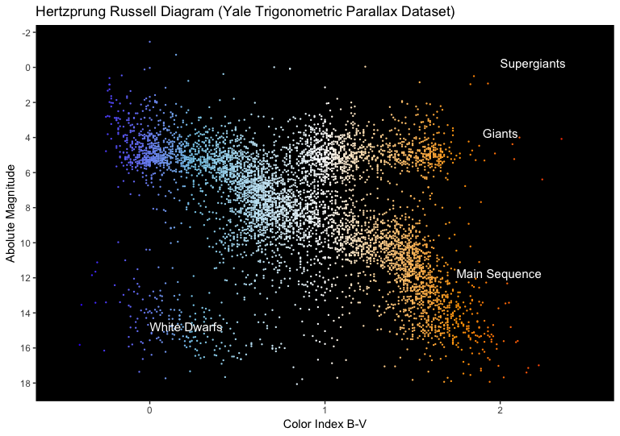

## Hertzsprung-Russell
R package to explore stellar evolution based on the Hertzsprung-Russell diagram  
Tony Gojanovic  
November 2018  

### Background

This package provides tools for visual exploration of stellar data using the Hertzsprung-Russell diagram using two types of data sets and two Hertzsprung-Russell graph interpretations (observation and theoretial H-R diagrams).

### What is the Hertzsprung-Russell diagram

The Hertzsprung-Russell diagram, or H-R diagram, is a powerful tool classifying stars in order to understand the nature of stellar evolution.  More specifically, from Wikipedia, we have "The Hertzsprung–Russell diagram, abbreviated H–R diagram, HR diagram or HRD, is a scatter plot of stars showing the relationship between the stars' absolute magnitudes or luminosities versus their stellar classifications or effective temperatures. More simply, it plots each star on a graph measuring the star's brightness against its temperature (color). The related colour–magnitude diagram (CMD) plots the apparent magnitudes of stars against their colour, usually for a cluster so that the stars are all at the same distance. The diagram was created circa 1910 by Ejnar Hertzsprung and Henry Norris Russell and represents a major step towards an understanding of stellar evolution."

For more information, see references below.

### Theoretical H-R Diagram

The following diagram is an example of a theoretical H-R diagram based on the McDonald Observatory data (n = 55 data points).  The plot shows stars by absolute magnitude and degrees Kelvin.  The example is not interactive, but the graphic produced by the R package is designed to interactive.


### Observational H-R Diagram

The following diagram is an example of an observational H-R diagram based on the Yale Trigonometric Parallax Dataset (n=6220 data points). The plot shows stars by absolute magnitude and color type.  The graph produced by the R package is not interactive.



### Package Details

Specific details on the package HRDiagram may be obtained through the vignette files.  The vignette files show specific usage and syntax.

### Package Name and Location

To install this package and begin exploring stellar life, use devtools and the following:

```r
devtools::install_github('cowboy2718/HRDiagram')
library(HRDiagram)
```

### Travis Badge

The following indicates the status of the most recent build with Travis:

[](https://travis-ci.org/cowboy2718/Hertzsprung-Russell)

### References

The following are useful resources.

Audouze and Guy Israel, editors, *The Cambridge Atlas of Astronomy,* Third Edition, Cambridge University Press, 1996.

North, Gerald, *Astronomy Explained,* Springer, London, 1998.

[More info on H-R Diagrams from Wikipedia](https://en.wikipedia.org/wiki/Hertzsprung%E2%80%93Russell_diagram)


